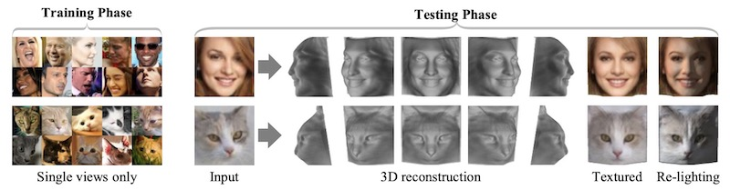

# Unsupervised Learning of Probably Symmetric Deformable 3D Objects from Images in the Wild
#### [Demo](http://www.robots.ox.ac.uk/~vgg/blog/unsupervised-learning-of-probably-symmetric-deformable-3d-objects-from-images-in-the-wild.html) | [Project Page](https://elliottwu.com/projects/unsup3d/) | [Video](https://www.youtube.com/watch?v=5rPJyrU-WE4) | [Paper](https://arxiv.org/abs/1911.11130)
[Shangzhe Wu](https://elliottwu.com/), [Christian Rupprecht](https://chrirupp.github.io/), [Andrea Vedaldi](http://www.robots.ox.ac.uk/~vedaldi/), Visual Geometry Group, University of Oxford. In CVPR 2020 (Best Paper Award).



We propose a method to learn weakly symmetric deformable 3D object categories from raw single-view images, without ground-truth 3D, multiple views, 2D/3D keypoints, prior shape models or any other supervision.


## Setup (with [Anaconda](https://www.anaconda.com/))

### 1. Install dependencies:
```
conda env create -f environment.yml
```
OR manually:
```
conda install -c conda-forge scikit-image matplotlib opencv moviepy pyyaml tensorboardX
```


### 2. Install [PyTorch](https://pytorch.org/):
```
conda install pytorch==1.2.0 torchvision==0.4.0 cudatoolkit=9.2 -c pytorch
```
*Note*: The code is tested with PyTorch 1.2.0 and CUDA 9.2 on CentOS 7. A GPU version is required for training and testing, since the [neural_renderer](https://github.com/daniilidis-group/neural_renderer) package only has GPU implementation. You are still able to run the demo without GPU.


### 3. Install [neural_renderer](https://github.com/daniilidis-group/neural_renderer):
This package is required for training and testing, and optional for the demo. It requires a GPU device and GPU-enabled PyTorch.
```
pip install neural_renderer_pytorch
```

*Note*: It may fail if you have a GCC version below 5. If you do not want to upgrade your GCC, one alternative solution is to use conda's GCC and compile the package from source. For example:
```
conda install gxx_linux-64=7.3
git clone https://github.com/daniilidis-group/neural_renderer.git
cd neural_renderer
python setup.py install
```


### 4. (For demo only) Install [facenet-pytorch](https://github.com/timesler/facenet-pytorch):
This package is optional for the demo. It allows automatic human face detection.
```
pip install facenet-pytorch
```


## Datasets
1. [CelebA](http://mmlab.ie.cuhk.edu.hk/projects/CelebA.html) face dataset. Please download the original images (`img_celeba.7z`) from their [website](http://mmlab.ie.cuhk.edu.hk/projects/CelebA.html) and run `celeba_crop.py` in `data/` to crop the images.
2. Synthetic face dataset generated using [Basel Face Model](https://faces.dmi.unibas.ch/bfm/). This can be downloaded using the script `download_synface.sh` provided in `data/`.
3. Cat face dataset composed of [Cat Head Dataset](http://academictorrents.com/details/c501571c29d16d7f41d159d699d0e7fb37092cbd) and [Oxford-IIIT Pet Dataset](http://www.robots.ox.ac.uk/~vgg/data/pets/) ([license](https://creativecommons.org/licenses/by-sa/4.0/)). This can be downloaded using the script `download_cat.sh` provided in `data/`.

Please remember to cite the corresponding papers if you use these datasets.


## Pretrained Models
Download pretrained models using the scripts provided in `pretrained/`, eg:
```
cd pretrained && sh download_pretrained_celeba.sh
```


## Demo
```
python -m demo.demo --input demo/images/human_face --result demo/results/human_face --checkpoint pretrained/pretrained_celeba/checkpoint030.pth
```

*Options*:
- `--gpu`: enable GPU
- `--detect_human_face`: enable automatic human face detection and cropping using [MTCNN](https://arxiv.org/abs/1604.02878) provided in [facenet-pytorch](https://github.com/timesler/facenet-pytorch). This does not work on cat images. You will need to manually crop the images instead.
- `--render_video`: render 3D animations using [neural_renderer](https://github.com/daniilidis-group/neural_renderer) (GPU is required)


## Training and Testing
Check the configuration files in `experiments/` and run experiments, eg:
```
python run.py --config experiments/train_celeba.yml --gpu 0 --num_workers 4
```


## Citation
```
@InProceedings{Wu_2020_CVPR,
  author = {Shangzhe Wu and Christian Rupprecht and Andrea Vedaldi},
  title = {Unsupervised Learning of Probably Symmetric Deformable 3D Objects from Images in the Wild},
  booktitle = {CVPR},
  year = {2020}
}
```
